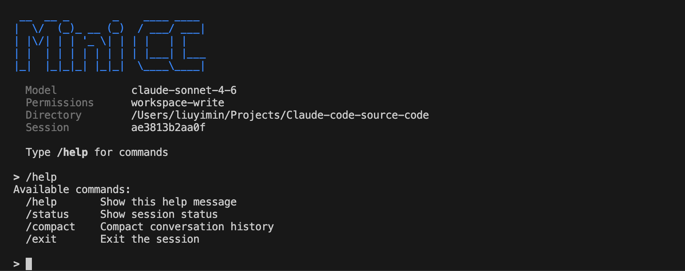

<div align="center">

# Mini-Claude-Code

**从源码学习 Claude Code，手写一个属于你自己的 AI Code Agent**

[](https://python.org)
[](https://docs.anthropic.com)
[](LICENSE)
[](https://github.com/Louisym/MiniCC/pulls)

<!-- 
  在这里放你的 mini claude code 运行截图 
  步骤：
  1. 运行 python3 -m mini_claude_code，截图终端画面
  2. 保存到 assets/demo.png (先创建 assets/ 目录)
  3. 取消下面这行的注释：
-->


<p>
<a href="#快速开始">快速开始</a> &nbsp;|&nbsp;
<a href="#项目结构">项目结构</a> &nbsp;|&nbsp;
<a href="#怎么用这个项目">学习路线</a> &nbsp;|&nbsp;
<a href="#致谢">致谢</a>
</p>

</div>

---

> 跟随本项目，你将学习 Claude Code 源码，了解当前 SOTA harness engineering 的核心问题与解决方案。
>
> 你会先从 **19 个教学 demo** 中一步一步学习关键技术；然后跟随指引，**手动从零搭建一个自己的 mini Claude Code**。

## 项目背景

不同于 GitHub 上其他复杂庞大的 Claude Code 源码解析资料，本项目更适合广大初学者、学生，旨在由浅入深帮助大家理解 Claude Code 的设计哲学：

| | 问题 | 回答 |
|---|------|------|
| 1 | 为什么想拆解 Claude Code？ | Claude Code 作为目前最强大的 Code Agent 系统，其 harness engineering 的设计非常值得学习。通过学习它，我们可以见微知著，弄清 SOTA harness engineering 应该往什么方向走。 |
| 2 | 市面上的教程有什么不足？ | 现有资料要么太过繁杂冗长，要么缺少实践巩固。而本项目不仅以**代码的形式教概念**，还会让你**一步一步手写一个属于自己的 mini Claude Code**！ |
| 3 | 你希望读者获得什么？ | 不仅仅是了解概念/设计，更要模仿 CC 源码，用 Python 实现一个自己的 Claude Code！**Talk is cheap, show me your code!** |

## 项目结构

```
.
├── tutorials/                 # 19 个 Python 教学 demo，由浅入深讲解 CC 核心概念
├── mini_claude_code/          # 手写的 mini 版 Claude Code (Python)
│   ├── guides/                # 13 个模块的学习引导，手把手教你每步怎么写
│   ├── models.py ~ main.py   # 13 个可供参考的实现文件（答案）
│   └── .env                   # API key（不会上传）
├── rust/                      # Claude Code 原始 Rust 源码（供对照阅读）
└── reference/                 # 源码分析参考笔记，感谢 github/openedclaude
```

## Tutorials 速览

19 个独立可运行的教学 demo，每个文件聚焦一个核心概念：

| # | 文件 | 主题 | 你会学到什么 |
|---|------|------|-------------|
| 01 | `agentic_loop_basics.py` | Agentic Loop 基础 | Agent 的心脏——感知-思考-行动循环 |
| 02 | `session_and_messages.py` | Session 与消息模型 | AI 的记忆系统，消息如何建模 |
| 03 | `tool_system.py` | Tool System | AI 的工具箱，注册/发现/执行 |
| 04 | `permission_system.py` | Permission System | 安全阀门，分级授权 |
| 05 | `agentic_loop_complete.py` | 完整 Agentic Loop | 整合前 4 个教程，跑通全流程 |
| 06 | `system_prompt_builder.py` | System Prompt Builder | 给 AI 写"角色说明书" |
| 07 | `auto_compaction.py` | Auto Compaction | AI 的"记忆压缩"，Token 管理 |
| 08 | `hook_system.py` | Hook System | 工具执行的"保安和监控" |
| 09 | `config_system.py` | Config System | 多层配置加载与深合并 |
| 10 | `sse_streaming.py` | SSE Streaming | 流式输出的秘密 |
| 11 | `error_recovery_and_retry.py` | 错误恢复与重试 | Agent 活下来的关键 |
| 12 | `session_persistence.py` | 会话持久化 | JSONL 追加式存储 |
| 13 | `multi_agent_coordination.py` | 多 Agent 协调 | 从独奏到交响乐 |
| 14 | `bash_engine_deep_dive.py` | Bash 执行引擎 | 子进程管理与安全执行 |
| 14a | `os_isolation_primer.py` | 操作系统隔离基础 | 沙箱的前置知识 |
| 14b | `networking_for_engineers.py` | 工程师网络知识 | 网络通信基础 |
| 15 | `permission_and_hook_pipeline.py` | 权限与 Hook 流水线 | 七层安全管线深度剖析 |
| 16 | `prompt_building_and_compaction.py` | 提示词构建与压缩 | 上下文工程深度剖析 |
| 17 | `async_await_for_sse.py` | async/await | 流式 API 的 Python 基础 |
| 18 | `design_patterns_for_agents.py` | Agent 设计模式 | 策略/观察者/责任链等模式 |
| 19 | `process_and_pipe_communication.py` | 进程与管道通信 | stdin/stdout/pipe 实战 |

## Mini Claude Code 模块速览

13 个模块，按依赖顺序排列，每个都忠实还原 CC Rust 源码的工程模式：

| # | 模块 | 对应 CC 源码 | 核心模式 |
|---|------|-------------|---------|
| 01 | `models.py` | session.rs | Discriminated Union |
| 02 | `tools.py` | tools/lib.rs | ToolRegistry + DI |
| 03 | `api_client.py` | api/client.rs | 流式事件 + 消息格式转换 |
| 04 | `config.py` | config.rs | 5-source 链 + 递归深合并 |
| 05 | `permissions.py` | permissions.rs | IntEnum 层级 + Protocol 回调 |
| 06 | `hooks.py` | hooks.rs | 退出码协议 (0/2/other) |
| 07 | `retry.py` | client.rs | 指数退避 + 溢出保护 |
| 08 | `prompt.py` | prompt.rs | 祖先链发现 + 预算截断 |
| 09 | `compact.py` | compact.rs | Token 估算 + 结构化摘要 |
| 10 | `storage.py` | sessionStorage.ts | JSONL 追加 + UUID 链 |
| 11 | `multi_agent.py` | tools/lib.rs | 泛型 spawn_fn + 工具白名单 |
| 12 | `runtime.py` | conversation.rs | Agentic Loop + 三层防线 |
| 13 | `main.py` | main.rs | 组装点 + REPL + Slash 命令 |

## 快速开始

```bash
# 1. 克隆项目
git clone https://github.com/Louisym/Claude-code-source-code.git
cd Claude-code-source-code

# 2. 安装依赖
pip install pydantic anthropic python-dotenv

# 3. 配置 API Key
echo "ANTHROPIC_API_KEY=sk-ant-xxx" > mini_claude_code/.env

# 4. 运行！
python3 -m mini_claude_code
```

## 怎么用这个项目？

### 路线一：从理解概念开始，到手写巩固

1. 从 `tutorials/` 开始，由浅入深学习概念，每章都有对应源码
2. 进入 `mini_claude_code/`，阅读 README.md，开始动手写
3. 每个 guide 包含：问题背景 → CC 源码分析 → 要写什么 → 易错点
4. 自己实现后，对照同名 `.py` 文件检查
5. 按 01 → 13 顺序走完，你就有了一个能跑的 Agent

### 路线二：只看概念

阅读 `tutorials/`，快速了解 Claude Code 的精华设计。

### 路线三：先跑起来，再拆解

```bash
python3 -m mini_claude_code
```

然后逐步根据功能，倒回去看 `mini_claude_code/` 中对应的代码实现。

## 前置知识

- Python 基础（class, decorator, type hint）
- 了解 Pydantic 的 BaseModel
- 不需要会 Rust（所有 Rust 代码都有 Python 对照）

## 致谢

感谢 [openedclaude](https://github.com/openedclaude/claude-reviews-claude) 对源码的精细拆解，是本项目的交叉验证来源。

## Star History

[](https://star-history.com/#Louisym/MiniCC&Date)

## License

本项目采用 [MIT License](LICENSE) 开源。
